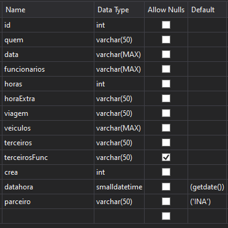
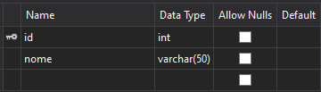
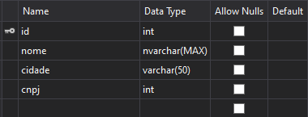
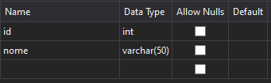

# Formulário de Compras - Cotepe Engenharia Elétrica

## Como testar localmente

### Stack

- VueJS
- NODE + MSSQL (SQL Server)

#### Configurar Frontend

```console
cd frontend
yarn
yarn serve
```

#### Configurar Backend

Serão necessarios 4 tabelas em SQL Server

São elas:

`dbo.backupForm`



`dbo.funcionarios`



`dbo.parceiros`



`dbo.vendas`



```console
cd backend
yarn
yarn dev
```
